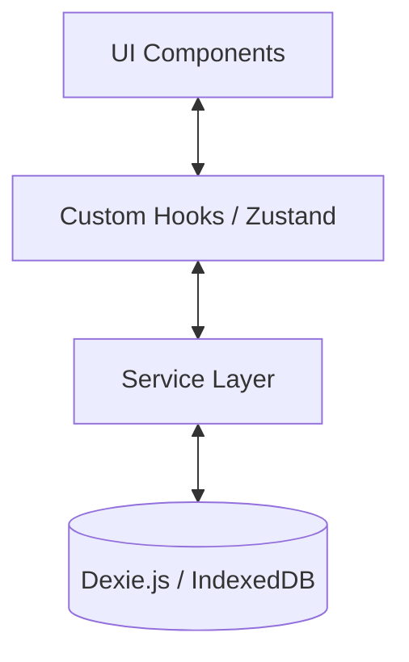

# Technical Implementation Scheme

## 1. Technology Stack

### Core Framework
*   **React 18**: Component-based UI library.
*   **Vite**: Fast build tool and development server.
*   **TypeScript**: Ensures type safety, critical for defining our Data Models.

### State Management & Persistence (Local-First)
*   **Dexie.js (IndexedDB Wrapper)**:
    *   *Role*: **Primary Database**.
    *   *Why?* We need to perform structured queries (e.g., "Get all focus sessions from last 7 days" or "Sum duration where date is today"). `localStorage` is too simple and inefficient for this. IndexedDB is the browser standard for robust offline storage.
*   **Zustand**:
    *   *Role*: **Global UI State**.
    *   *Why?* Lightweight and simple. We will use it to manage "live" transient state (like the active timer countdown, current navigation state) that doesn't need to be permanently queried but needs to be shared across components.

### Utilities
*   **date-fns**: For robust date manipulation (calculating streaks, start/end of day, formatting).
*   **clsx / tailwind-merge**: For cleaner dynamic CSS class management.
*   **uuid**: For generating unique identifiers for tasks and sessions.

## 2. Architecture Design

We will use a **Service-Oriented Architecture** to separate the UI from the Data Logic.

### 2.1 Database Schema (Dexie)
We will define a `FocusDatabase` class.

*   **`sessions` Table**:
    *   Schema: `id, startTime, endTime, mode, status, duration`
    *   Indexes: `startTime` (for date ranges), `mode` (for filtering), `status`.
*   **`tasks` Table**:
    *   Schema: `id, title, status, created_at`
    *   Indexes: `status` (active vs completed).
*   **`profile` Table**:
    *   Schema: `key, value` (Key-Value store for singletons like 'balance', 'username').

### 2.2 Service Layer
Pure TypeScript modules that handle business logic.

*   **`SessionService`**:
    *   `startSession(mode, taskId)`: Initializes a session.
    *   `completeSession(result)`: Finalizes session, calculates rewards, updates user balance in a transaction.
    *   `getDailyStats(date)`: Aggregates total focus time for a specific day.
*   **`TaskService`**:
    *   `createTask(title, target)`
    *   `addProgress(taskId, minutes)`
*   **`ProfileService`**:
    *   `updateBalance(amount)`: Handles adding/spending rewards.

### 2.3 Live Timer Logic
*   **Persistence Strategy**: The *active* timer state (seconds remaining, isPaused) will be saved in `localStorage` (via Zustand middleware) to survive page reloads.
*   **Completion**: When the timer finishes, it flushes the result to **Dexie.js** for permanent history.

## 3. Implementation Plan

### Phase 1: Foundation
1.  Install dependencies: `dexie`, `zustand`, `date-fns`, `uuid`.
2.  Initialize `src/db/db.ts` with the schema.
3.  Create `src/services/` for core logic.

### Phase 2: Core Features
4.  **Profile & Home**: Implement `ProfileService` and connect `Home.tsx` to read real stats.
5.  **Tasks**: Implement `TaskService` and refactor `Tasks.tsx` to use the DB.
6.  **Focus Timer**: Connect the timer to `SessionService` to record real history.

### Phase 3: Analytics
7.  **History**: Refactor `History.tsx` to query Dexie using `useLiveQuery`.
8.  **Settings**: Persist settings to the DB or LocalStorage.
